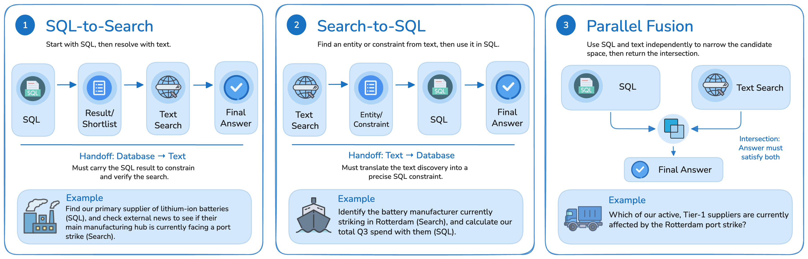
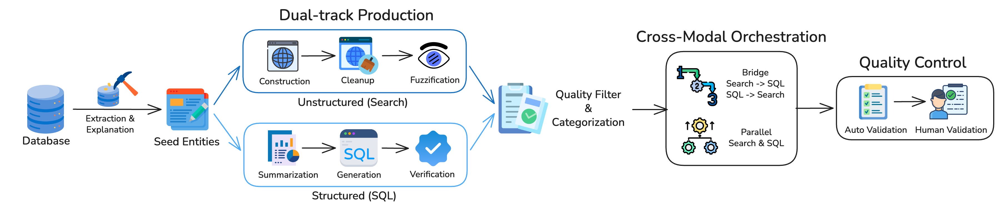

# HybridDeepResearch

<div align="center">
  <p><strong>A benchmark for deep-research agents that reason across SQL databases and the open web.</strong></p>

<a href="https://www.snowflake.com/en/blog/authors/snowflake-ai-research/"></a>&nbsp;<a href="https://refactored-couscous-pz385jr.pages.github.io/"></a>&nbsp;&nbsp;

</div>

HybridDeepResearch evaluates whether an agent can preserve constraints while moving
between structured enterprise data and unstructured web evidence. A system must do
more than solve an isolated SQL or search problem: it must carry the right entity,
filter, or candidate set across modalities and return one end-to-end answer.

## Updates

- **Coming soon** — Paper and benchmark data release.
- **August 2026** — Repository preview with reference prompts, public tools,
  evaluation scripts, and preprocessing utilities.
- **June 2, 2026** — HybridDeepResearch introduced in the
  [Snowflake Engineering Blog](https://www.snowflake.com/en/blog/engineering/hybrid-deep-research-benchmark/);
  the initial [leaderboard](https://refactored-couscous-pz385jr.pages.github.io/) went live.

## Benchmark at a glance



HybridDeepResearch contains three task categories:

- **SQL-to-Search (SQL2S):** query the database to obtain a bridge entity, then use
  that entity to resolve a web question.
- **Search-to-SQL (S2SQL):** identify an entity from web evidence, then use it as a
  database constraint.
- **Parallel Fusion:** solve the SQL and search legs independently and intersect their
  candidate sets.

The public release is intended for local development and iteration with read-only
SQLite databases. Official held-out evaluation uses a governed Snowflake database.

## How tasks are built



The benchmark begins with database-grounded seed entities and develops two
complementary tracks: a structured SQL task and an unstructured search task. Tasks are
filtered for quality, composed into cross-modal problems, and validated before entering
evaluation.

## Repository layout

```text
HybridDeepResearch/
├── assets/figures/             # Selected paper figures used by the docs
├── data/                       # Release notes and expected data layout
├── docs/
│   ├── agent-interface.md      # Prompt and task I/O contract
│   └── submission.md           # Submission checklist
├── evaluation/
│   ├── prompts/answer_judge.txt
│   ├── llm_judge.py            # SQL2S / Parallel text-answer judge
│   └── s2sql_eval.py           # S2SQL read-only execution match
├── prompts/
│   ├── system_prompt.txt       # Minimal capability/output contract
│   └── user_prompt.txt         # Agent-visible task template
├── preprocess/
│   ├── build_dataset_releases.py
│   ├── prepare_public_tasks.py
│   └── validate_predictions.py
├── tools/                      # Public tool schemas and reference backends
├── LICENSE                     # Apache License 2.0
└── requirements.txt
```

This repository contains public examples and interfaces, not the production agent used
to produce internal benchmark results. The model, retrieval strategy, orchestration,
and prompt design remain open choices for participants.

## Evaluation setup

HybridDeepResearch does not require a particular agent framework. Connect your own
system to the task and tool interfaces described below; the minimal
[`system prompt`](prompts/system_prompt.txt) and
[`user prompt`](prompts/user_prompt.txt) show the expected contract.

```bash
python -m venv .venv
source .venv/bin/activate
pip install -r requirements.txt
```

Dataset download instructions will be added when the Hugging Face release is available.

## Task interface

At runtime, an agent receives a final question, an optional hint, and limited database
metadata. For local public tasks this is the database name. The official Snowflake
harness provides the governed schema, domain, and primary table, but not the columns or
full schema. It does not expose the gold bridge entity, gold SQL, search reasoning
chain, or final answer.

```text
## Final question
{final_question}

## Hint
{hint}

## Database
{database_metadata}
```

An agent may use its own tools and architecture. Database access must be read-only, and
the run must finish with exactly one final answer in the task's expected format. The
public tool names and argument schemas are in [`tools/`](tools/README.md). The complete
example contract is in [`docs/agent-interface.md`](docs/agent-interface.md).

## Evaluation

Scoring is end-to-end and binary. Partial progress on only the SQL or search leg does
not count as a correct solution.

- **SQL2S and Parallel:** concise text answers are compared against gold answers using
  a deterministic (`temperature=0`) BrowseComp-style LLM judge.
- **S2SQL:** the submitted canonical SQL and gold SQL are executed read-only; their
  result tables are compared after column alignment.

For SQL2S and Parallel, the public text-answer judge includes both the exact prompt and
a provider-neutral OpenAI-compatible runner:

```bash
export JUDGE_API_KEY="..."
export JUDGE_MODEL="your-judge-model"

python evaluation/llm_judge.py \
  --input predictions_with_gold.jsonl \
  --output judgments.jsonl
```

See [`evaluation/README.md`](evaluation/README.md) for the input format and auditing
fields.

For S2SQL, run the standalone SQLite execution-match evaluator:

```bash
python evaluation/s2sql_eval.py \
  --input s2sql_predictions_with_gold.jsonl \
  --db-root /path/to/sqlite_databases \
  --output s2sql_judgments.jsonl
```

## Data and preprocessing

The benchmark data is not included in this GitHub preview; it will be released as a
public test set with gold answers so local grading is possible. Agent runs should still
only consume `final_question`, `hint`, and `db`.

The preprocessing examples show how to:

1. merge the v1 baseline with sparse v2 corrections into release JSONL files;
2. optionally strip gold fields when you only want agent-facing inputs;
3. validate a submission's `predictions.jsonl` before evaluation.

See [`data/README.md`](data/README.md) and
[`preprocess/README.md`](preprocess/README.md).

## Submission

The expected submission artifact is a JSONL file keyed by `instance_id`, together with
system metadata and a short method description. Before preparing an official
submission, read [`docs/submission.md`](docs/submission.md).

## Citation

Citation metadata will be added with the paper release. Until then, please reference
the [HybridDeepResearch announcement](https://www.snowflake.com/en/blog/engineering/hybrid-deep-research-benchmark/).

## License

This repository is released under the [Apache License 2.0](LICENSE).
