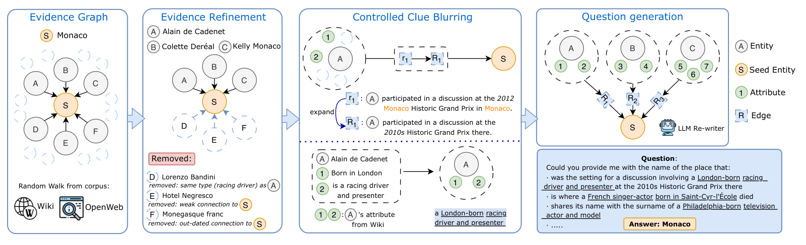
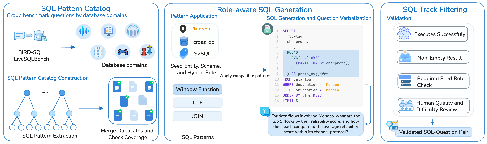

# Data

The HybridDeepResearch data release is forthcoming.

The public package is a test set, not a hidden set. It ships the full task records,
including gold answers and reference SQL, so anyone can grade runs locally. Local
SQLite databases are released alongside the tasks.

## How the search and SQL tracks are built

Search questions start from a seed entity, walk related evidence, drop weak or
redundant neighbors, blur remaining clues, and rewrite them into a multi-hop
question whose answer is still the original entity.

SQL questions reuse a role-aware generation pipeline: pattern catalog, seed
entity plus schema, then execution and human filters.

Two versioned task files are planned:

- **Preview**: the complete v1 task set used for the paper results.
- **Release**: the same task IDs and ordering, with internally validated v2
  corrections replacing their v1 records.

The v2 source is a sparse patch, not a standalone dataset. It must be overlaid on v1
by task ID and must not be appended directly.

Each version is a single JSONL file covering all three task categories. Record fields:

| Field | Purpose |
| --- | --- |
| `id` | Stable task identifier, unique across categories |
| `hybrid_type` | `sql_to_search`, `search_to_sql`, or `parallel` |
| `final_question` | The question given to the agent |
| `hint` | Optional extra guidance, empty string when unused |
| `db` | Target SQLite database name |
| `final_answer` | Gold answer used for grading |
| `sql`, `sql_question`, `sql_output` | Reference SQL side of the task |
| `search_question`, `search_answer`, `search_reasoning_chain` | Reference search side of the task |
| `entity`, `sql_source`, `sql_knowledge_id`, `sql_pattern_id` | Construction provenance |

Agents should only receive `final_question`, `hint`, and `db`. The remaining fields are
references for grading and analysis.

The final counts and download instructions will be published here with the
release. Repository contents are provided under the
[Apache License 2.0](../LICENSE). The official release documentation takes precedence
over this preview.
