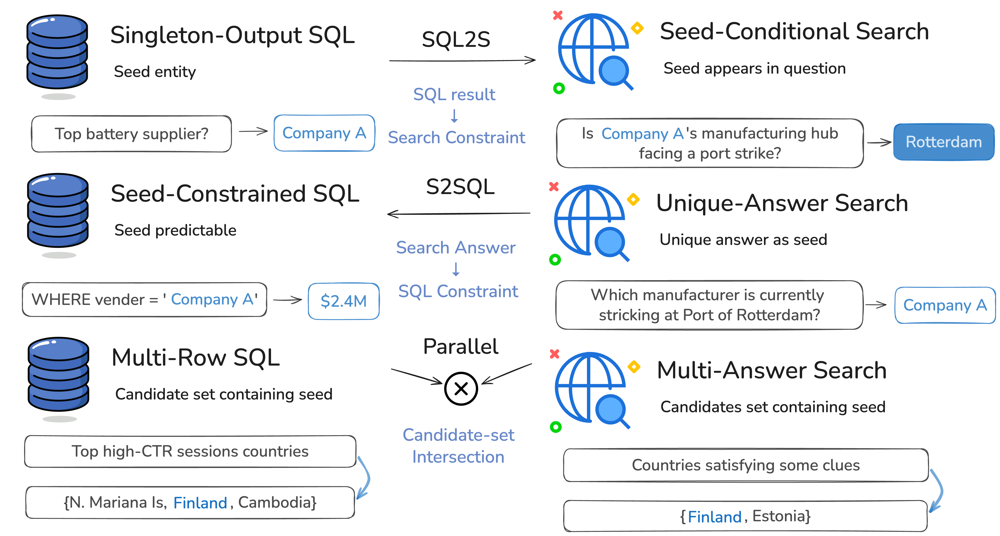

# Preprocessing examples

The full benchmark construction pipeline combines structured SQL generation,
unstructured search-question generation, quality filtering, and cross-modal
composition.



This preview includes three small utilities around the public interface. They are not the
internal data-generation pipeline.

## Build release files

`build_dataset_releases.py` merges the three task categories into one JSONL per
version. The preview is the complete v1 dataset used for the paper results. The
release starts from v1 and replaces matching IDs with the sparse v2 corrections.
It rejects duplicate IDs, unknown patch IDs, and unchanged patch records.

Both outputs keep the complete record, including gold answers, so the released test
set is self-contained for local grading. Each record gains a `hybrid_type` field
derived from its task category.

```bash
python preprocess/build_dataset_releases.py \
  --v1-root /path/to/hybrid_ds_v1_full \
  --v2-root /path/to/hybrid_ds_v2_full \
  --output-root /path/to/final-data
```

This creates:

- `hybrid_ds_preview/hybrid_ds_preview.jsonl`;
- `hybrid_ds_release/hybrid_ds_release.jsonl`;
- `manifest.json`, including per-type counts and SHA-256 checksums.

## Prepare public tasks

`prepare_public_tasks.py` is optional. Use it when you want an answer-free input file,
for example to hand tasks to an agent without gold labels in context. It retains
only:

- `id`;
- `hybrid_type`;
- `final_question`;
- optional `hint`;
- `db`.

Construction artifacts such as bridge entities, gold SQL, search reasoning, and final
answers are not copied.

```bash
python preprocess/prepare_public_tasks.py \
  --input construction_tasks.jsonl \
  --output public_tasks.jsonl
```

Accepted `hybrid_type` values are `sql_to_search`, `search_to_sql`, and `parallel`.

## Validate predictions

Check IDs, duplicate records, unexpected fields, empty answers, and structured-result
shape:

```bash
python preprocess/validate_predictions.py predictions.jsonl
```

The validator accepts string answers. For S2SQL, that string contains the canonical
query in a fenced `sql` block.
